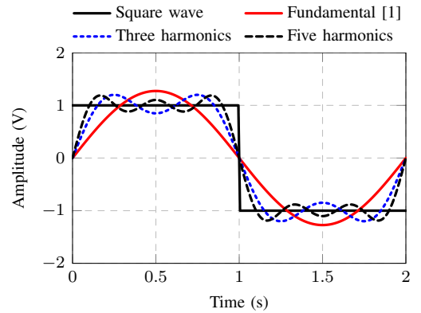
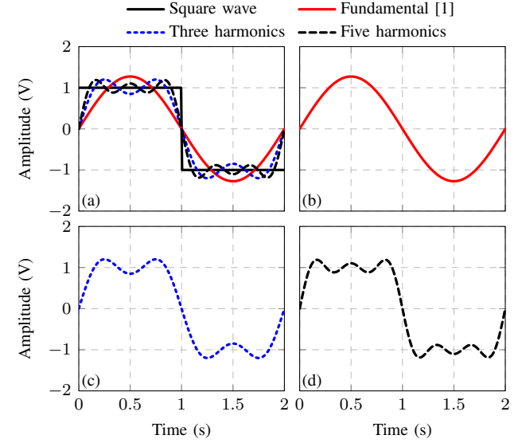

# Cadwiki Overleaf Tutorial
This document describes how to use Overleaf to generate clean vector graphic plots and diagrams, as well as preparing references for IEEE style compliance. This is also applicable to using a local installation of LaTeX.

Why should you generate figures in LaTeX rather than in Matlab, Python, Visio, etc?
1. It separates formatting from content. This makes it easy to re-style your figure to fit in your paper without touching the underlying data, or re-running scripts.
2. Style automatically matches the rest of your paper, including font and font sizes.
3. Access to your bibliography, so references can be included within the figure.
4. Automatic vector graphics. All figures should be vector graphics, with the exception of photos (of your die or measurement setup, for example).

### [All of the examples shown here are implemented in this Overleaf project](https://www.overleaf.com/read/qznyrkjntprq)
This is formatted for a generic IEEE conference; other LaTeX templates can be found [on the IEEE website](https://journals.ieeeauthorcenter.ieee.org/create-your-ieee-journal-article/authoring-tools-and-templates/ieee-article-templates/). Scripts discussed here are available in the [doc/scripts/](doc/scripts/) folder.

## Contents
* [General formatting](#general-formatting)
* [Initial setup](#initial-setup)
* [Generating plots](#generating-plots)
  * [Data preparation](#data-preparation)
  * [Examples](#examples)
    * [Single plot](#single-plot)
    * [Group plot](#group-plot)
* [Generating circuit diagrams](#generating-circuit-diagrams)
  * [Example](#example)
* [Other figure types](#other-figure-types)
  * [Timing diagrams](#timing-diagrams)
  * [Tables](#tables)
* [Preparing references](#preparing-references)
  * [Export from Mendeley](#export-from-mendeley)


## General formatting
[See the IEEE Style Manual](http://journals.ieeeauthorcenter.ieee.org/wp-content/uploads/sites/7/IEEE-Editorial-Style-Manual.pdf) for IEEE-specific policies. Technically it is for IEEE transactions, journals, and letters, but much of it should be applied to conferences as well.

As a general rule, you want to separate formatting from content. As an example, you do not want to set a font size to exactly 10pt. Instead, you should use the [standard LaTeX font size commands](https://www.sascha-frank.com/latex-font-size.html). The document-wide font size is set as an option of `documentclass`, and each of these size commands is defined relative to that global font size.

To this end, custom commands are a valuable tool. For example, I wanted to reduce the space after each figure in my paper in order to reduce the overall length by a few lines (to fit within the page limit). Rather than typing `\vspace{-1em}` once after each figure, I defined a new command in the preamble and called this command after each figure:
```latex
\newcommand{\swDecreaseFigSpacing}{\vspace{-0.9em}}
```
I then modified the spacing in one place -- the preamble -- while maintaining consistent spacing throughout the paper.

When making plots, keep them simple and consistent for readability. Here are a few tips:
* Thick lines, few colors, and black & white readability (for the colorblind) are helpful. Avoid using both red and green (again, for the colorblind). Ideally, each curve has both a unique color and shape, but this isn't always possible.
* Red is often associated with negativity, while blue is associated with positivity. So if you are comparing to prior art, don't make theirs blue and yours red.
* Make sure dashed lines are drawn on top of solid ones, and markers without lines on top of all lines. This way all data is visible.
* Use consistent line styling when referring to the same configuration (i.e. when the legend entries match). In the plot examples here, I used the same solid black for the square wave, solid blue for the fundamental, solid red for three harmonics, and dashed black for five harmonics.

There are many ways to control white space in LaTeX in order to bring your paper below the page limit. The easiest way is with `\vspace{-1em}` (or whatever height you want to remove). This can also be helpful to add a little bit of extra space before section headers when the page feels too dense.

Figures and tables (and other float objects) by default have a lot of white space surrounding them. You can reduce this space with `\addtolength{\textfloatsep}{-0.3em}`, but I found that using `\vspace` at the end of each figure helped as well. (I made a custom function to reduce this spacing, so I could change one value in the preamble and have it modify spacing around every figure in the paper.)

Equations can also have too much spacing around them by default, especially for denser conference papers. In this case, you can use the following two commands to reduce the spacing before and after the equation:
```latex
\setlength{\abovedisplayskip}{5pt}
\setlength{\belowdisplayskip}{5pt}
```

Don't forget to include the Acknowledgment section and author/affiliation information before final formatting. I forgot the Acknowledgment section and it took at least an hour to reformat so that it would fit.


## Initial setup
In keeping with the separation between style and content, I use the following file structure:
* `bib/` contains the bibliography (BibTeX) file(s).
* `data/` contains all data to be plotted, in CSV format.
* `fig/` contains TeX files which generate the figures.
* `ieee/` contains IEEE-provided styles. (It is possible on Overleaf to create a workspace which automatically references these IEEE styles, but I found when copying a project it lost some references. I recommend manually including these files, as I have here, which will also allow you to compile locally if desired.)
* `main.tex` contains the actual text of the paper, and imports the figure TeX files from `fig/`.
* `preamble.tex` is where I import and configure packages, define custom commands, and other preamble.

Note that this project has an extra folder `doc/` and this file `README.md` which are only for documentation and providing helpful scripts. No image files (PNG, BMP, etc) should be in the project unless a JPG is needed to show the die photo or measurement setup, in which case it should go in `fig/`.

To include the preamble in your main file, use `\include` (similarly to include figures). `main.tex` looks like this:
```latex
\documentclass[conference]{IEEEtran}
\input{preamble.tex}
\begin{document}
% Content goes here
\end{document}
```


## Generating plots
Plots can be created directly by LaTeX using the PGFPlots package. This package can plot imported matrices or mathematical expressions, on a variety of 2D and 3D plot types. The documentation ([available here](https://ctan.org/pkg/pgfplots)) is a valuable resource.

To use PGFPlots, include the following in your preamble.
```latex
\usepackage{pgfplots}
\pgfplotsset{compat=1.9}
\usetikzlibrary{pgfplots.groupplots}
```


### Data preparation
Before plotting, you need to save your data to file. In this example I will show how I export from Matlab to CSV, but other file formats are also accepted.

By using a cell array to save the data, it is easy to have columns of different lengths (not taken advantage of in this example). This full script with sample data is at [doc/scripts/cadwiki_example.m](doc/scripts/cadwiki_example.m).
```matlab
% Create cell array to hold our data. Set it to the maximum size you might
% want: in this case, I need 5 columns (x, sq, sq1, sq3, sq5) and am 
% allowing for up to 1000 data points.
data = cell(1000, 5);
% Set the header row
data(1,:) = {'x', 'sq', 'sq1', 'sq3', 'sq5'};
% Set the data
data(2:1+length(x),1) = num2cell(x);
data(2:1+length(sq),2) = num2cell(sq);
data(2:1+length(sq1),3) = num2cell(sq1);
data(2:1+length(sq3),4) = num2cell(sq3);
data(2:1+length(sq5),5) = num2cell(sq5);
% Get rid of extra empty rows (in this case, it reduces to 201 rows)
data=data(~all(cellfun(@isempty,data),2),:);
% Save to CSV file
T = cell2table(data(2:end,:),'VariableNames',data(1,:));
writetable(T,'cadwiki_example.csv')
```

The CSV file will look something like the following (only the first few lines are shown). The first line contains text that identifies the contents of each column in order to be referenced in the LaTeX code. The data should all be numbers formatted as a general number. That is, `123456.789` instead of `1.23456789e5`. Also, when preparing your data, consider how many data points are actually required: typically a few hundred should be sufficient and going over 1000 or so can increase LaTeX compile time. The full CSV file is at [data/cadwiki_example.csv](data/cadwiki_example.csv).
```
x,sq,sq1,sq3,sq5
0,1,0,0,0
0.0100502512562814,1,0.0401943259304967,0.0803352430697792,0.120369470368499
0.0201005025125628,1,0.0803485852827736,0.160270538786003,0.239343306293108
0.0301507537688442,1,0.120422751417848,0.239409206221979,0.355553903386545
```


### Examples
To make a plot, first copy that CSV file to the `data/` folder. Then, create a new TeX file in the `fig/` folder in which to define the plot. What follows are examples for making line plots. Other 2D and 3D plots are described in the PGFPlots documentation.

Note that the styling on these plots is poor: in black and white, the lines cannot be distinguished.

#### Single plot



The full TeX file to generate this figure is at [fig/single_plot.tex](fig/single_plot.tex).

First, create an axis which we will then configure. This is roughly equivalent to configuring both the "figure" and "axis" in Matlab.
```latex
\begin{tikzpicture}
\begin{axis}[
	% Plot dimensions
	width=2in,
	height=2in,
	% Set font sizes to match your figure caption
	tick label style={font=\footnotesize},
	label style={font=\footnotesize},
	legend style={font=\footnotesize},
	% Axis labels, limits, tick marks, and grid lines. Limits and ticks will be auto-configurd if commented out.
	xlabel={Time (s)},
	ylabel={Amplitude (V)},
	xmin=0, xmax=2,
	ymin=-2, ymax=2,
	% xtick={-8, -4, 0, 4, 8},
	% ytick={-5, 0, 5},
	ymajorgrids=true,
	xmajorgrids=true,
	grid style=dashed,
	% Configure the legend
	% This sets the legend at the top center, just outside the plot. "Anchor" means that the southern point (i.e. bottom center) of the legend bounding box is set to the given coordinates.
	legend style={at={(0.50,1.00)}, anchor=south}, 
	% If -1, it will use a single row and as many columns as needed.
	legend columns=2,
	% Text alignment
	legend cell align={left},
	% Hide the border around the legend
	legend style={draw=none},
]
```

Then, create the plots. This is configured to read from a table separated by commas (i.e. CSV file), with a header row, and x-data found in column "x" and y-data found in column "sq".
```latex
\addplot[color=black,mark=none,style=very thick] table[col sep=comma,header=true,x=x,y=sq] {data/cadwiki_example.csv};
\addplot[color=red,mark=none,style=very thick] table[col sep=comma,header=true,x=x,y=sq1] {data/cadwiki_example.csv};
\addplot[color=blue,mark=none,style=very thick,dotted] table[col sep=comma,header=true,x=x,y=sq3] {data/cadwiki_example.csv};
\addplot[color=black,mark=none,style=densely dashed] table[col sep=comma,header=true,x=x,y=sq5] {data/cadwiki_example.csv};
```
Common plot style options are `color`, `mark` (`none`, `circle`, `square`, `x`, etc), and `style` (`very thick`, `solid`, `densely dashed`, etc). Use `only marks` to get rid of the line, for example to show measurement data. Other options are available in the documentation ([available here](https://ctan.org/pkg/pgfplots)).

Lastly, create the legend. I felt that the first legend text was too close to the second, so I used `\phantom` to create some horizontal space. This isn't necessary, but looks nice. In addition, you could easily include citations or references to sections of the text (unlike figures exported directly from Matlab).
```latex
\legend{Square wave\cite{Muratore2019}\phantom{--},Fundamental,Three harmonics\phantom{--},Five harmonics}
\end{axis}
\end{tikzpicture}
```

Another feature of `\addplot` is the `smooth` option for automatic curve smoothing; see the documentation for more information. It could be useful for qualitative curves.


#### Group plot

Instead of plotting all of these on a single plot, you could do a group plot with shared axes (like subplot in Matlab). The TeX file for this example is at [fig/multi_plot.tex](fig/multi_plot.tex).



The gist is that instead of an `axis` you create a `groupplot` and then include an extra configuration section to define the subplots:
```latex
	group style={
		% Name doesn't seem to matter (can probably be referenced somewhere)
		group name="analysis",
		group size=2 by 2,
		% Use shared x and y axes
		x descriptions at=edge bottom,
		y descriptions at=edge left,
		% Set spacing between plots
		horizontal sep=0.1in,
		vertical sep=0.1in,
	},
```
Then, use `\nextgroupplot` to switch between subplots:
```latex
\nextgroupplot
\addplot[color=black,mark=none,style=very thick] table[col sep=comma,header=true,x=x,y=sq] {data/cadwiki_example.csv};
\addplot[color=red,mark=none,style=very thick] table[col sep=comma,header=true,x=x,y=sq1] {data/cadwiki_example.csv};
\addplot[color=blue,mark=none,style=very thick,dotted] table[col sep=comma,header=true,x=x,y=sq3] {data/cadwiki_example.csv};
\addplot[color=black,mark=none,style=densely dashed] table[col sep=comma,header=true,x=x,y=sq5] {data/cadwiki_example.csv};
\legend{Square wave\phantom{--},Fundamental\cite{Muratore2019}\phantom{--},Three harmonics\phantom{--},Five harmonics}
\nextgroupplot
\addplot[color=red,mark=none,style=very thick] table[col sep=comma,header=true,x=x,y=sq1] {data/cadwiki_example.csv};
\nextgroupplot
\addplot[color=blue,mark=none,style=very thick,dotted] table[col sep=comma,header=true,x=x,y=sq3] {data/cadwiki_example.csv};
\nextgroupplot
\addplot[color=black,mark=none,style=densely dashed] table[col sep=comma,header=true,x=x,y=sq5] {data/cadwiki_example.csv};
```


## Generating circuit diagrams
CircuiTikZ is essentially a library of circuit elements and enables LaTeX-compiled circuit diagrams, building on the general TikZ plotting package. The documentation ([available here](https://ctan.org/pkg/circuitikz)) lists all available circuit elements, though I found Stackoverflow to be more helpful in most cases. 

As a basic concept, your diagram is divided into a grid and each 2-terminal element is defined as between two grid coordinates. Larger elements are defined by a single coordinate and orientation, and pin coordinates can be extracted from the element. CircuiTikZ supports variables, making it easy to modify diagrams.

To load CircuiTikZ, include the following in the preamble. Note that this also does some global configuration.
```latex
\usepackage{circuitikz-0.8.3}
\tikzstyle{every path}=[line cap=round,line join=round]
\usetikzlibrary{calc}
```
Here I loaded version 0.8.3 for compatibility, since the diagrams I made were before some new styling options were added. You should probably use the latest version.

### Example

This is best understood by considering an example. This example is available in [fig/circuit_mixer.tex](fig/circuit_mixer.tex).


CircuitTikZ defines macros for each circuit element, and their sizes are all fixed. I think that some elements are by default too large, so I used global commands to change their dimensions.
```latex
\tikzset{C/.append style={/tikz/circuitikz/bipoles/length=0.4cm}}
\tikzset{R/.append style={/tikz/circuitikz/bipoles/length=0.4cm}}
\tikzset{every rxantenna node/.append style={/tikz/circuitikz/bipoles/length=0.7cm}}
```

Next, you need to configure the CircuitTikZ environment. The `scale` option determines the distance between grid points, and I found 0.25 to allow for (mostly) integer coordinates. I also set the solderdot scale factor, font size, and line width.
```latex
\begin{circuitikz}[
    scale=0.25,
    every node/.style={scale=0.8},
    every circ node/.style={scale=0.7},
    ]
    \tikzstyle{every node}=[font=\scriptsize]
    \tikzstyle{every path}=[line width=0.6pt]
```

Whenever possible, define your diagram using variables. This makes it easier to reconfigure the diagram if needed. Here I will use variables to set various x- and y- coordinate positions.
```latex
    %%% Set various positions
    \def\xin{-8}; % mixer input
    \def\yin{0}; % mixer input
    \def\xcl{-1.5}; % C_L
    \def\xrl{0}; % R_L
    \def\yA{4.5}; % vbb0/3
    \def\yB{1.5}; % vbb1/2
```

Now we make an element: first, the antenna.
```latex
    %%% Antenna
    \draw (\xin,\yin) node[circ]{} -- ++(-1,0) node[rxantenna,xscale=-1]{};
```
Let's break that down into its constituent components:
* `\draw (\xin,\yin)` says where we should start putting the pen down
* `node[circ]{}` says to draw a solid solder dot at this node
* `-- ++(-1,0)` says to, while keeping the pen down, move left by 1 grid point
* `node[rxantenna,xscale=-1]{}` creates a RX antenna at this node. The `xscale` parameter horizontally flips the component, so it's facing the right way.

From there, we can continue and make the rest of the diagram: some switches, resistors, and capacitors. Note that a single `draw` command can create multiple elements and segments. Also, every element can include text using the `l` (label) parameter. I used a `raisebox` to set the switch text position in the way that I wanted.
```latex
    %% Switches
    \draw (\xin,\yin) -- (\xin, \yA)              -- ++(1,0) to[switch,l=\raisebox{0.2em}{SW0}] ++(4,0) -- (0,\yA);
    \draw         (\xin, \yB) node[circ]{} -- ++(1,0) to[switch,l=\raisebox{0.2em}{SW1}] ++(4,0) -- (0,\yB);
    \draw         (\xin,-\yB) node[circ]{} -- ++(1,0) to[switch,l=\raisebox{0.2em}{SW2}] ++(4,0) -- (0,-\yB);
    \draw (\xin,\yin) -- (\xin,-\yA)              -- ++(1,0) to[switch,l=\raisebox{0.2em}{SW3}] ++(4,0) -- (0,-\yA);
    %% Baseband
    \draw (\xcl, +\yA) node[circ]{} -- ++(0,-0.5) to[C] ++(0,-1.0) node[sground,scale=0.3,rotate=0]{};
    \draw (\xcl, +\yB) node[circ]{} -- ++(0,-0.5) to[C] ++(0,-1.0) node[sground,scale=0.3,rotate=0]{};
    \draw (\xcl, -\yB) node[circ]{} -- ++(0,-0.5) to[C] ++(0,-1.0) node[sground,scale=0.3,rotate=0]{};
    \draw (\xcl, -\yA) node[circ]{} -- ++(0,-0.5) to[C] ++(0,-1.0) node[sground,scale=0.3,rotate=0]{};
    \draw (\xrl, +\yA)              -- ++(0,-0.5) to[R] ++(0,-1.0) node[sground,scale=0.3,rotate=0]{};
    \draw (\xrl, +\yB)              -- ++(0,-0.5) to[R] ++(0,-1.0) node[sground,scale=0.3,rotate=0]{};
    \draw (\xrl, -\yB)              -- ++(0,-0.5) to[R] ++(0,-1.0) node[sground,scale=0.3,rotate=0]{};
    \draw (\xrl, -\yA)              -- ++(0,-0.5) to[R] ++(0,-1.0) node[sground,scale=0.3,rotate=0]{};
```

CircuitTikZ also supports general TikZ commands. Here, I create some connected linear segments for a very simple timing diagram. This code isn't well-written.
```latex
    %%% Timing diagram
    \tikzstyle{every path}=[line width=1.2pt]
    \draw (5,-3) coordinate (lo);
    \draw (lo)++(0,4.50) ++(0,0.5) node[]{\footnotesize SW0} ++(1.75,-0.5) -- ++(0,0) -- ++(0,1) -- ++(1,0) -- ++(0,-1) -- ++(3,0);
    \draw (lo)++(0,3.00) ++(0,0.5) node[]{\footnotesize SW1} ++(1.75,-0.5) -- ++(1,0) -- ++(0,1) -- ++(1,0) -- ++(0,-1) -- ++(2,0);
    \draw (lo)++(0,1.50) ++(0,0.5) node[]{\footnotesize SW2} ++(1.75,-0.5) -- ++(2,0) -- ++(0,1) -- ++(1,0) -- ++(0,-1) -- ++(1,0);
    \draw (lo)++(0,0.00) ++(0,0.5) node[]{\footnotesize SW3} ++(1.75,-0.5) -- ++(3,0) -- ++(0,1) -- ++(1,0) -- ++(0,-1) -- ++(0,0);
\end{circuitikz}
```


A more complex example is in [fig/circuit_rx.tex](fig/circuit_rx.tex). Here are a few key lines from that code.

In this code, we create an opamp element. This element is defined by its center coordinate, but I need to have wires coming out of its input and output. For these to line up, I can extract and save the x- and y-coordinates of its input positive and negative nodes for reuse later.
```latex
    \draw (\xop,-\yop) node[fd op amp] (opamp) {};
    \node at (opamp) {\normalsize A\phantom{AAA}}; % hack to get spacing right
    \newdimen\yopp; \pgfextracty{\yopp}{\pgfpointanchor{opamp}{+}};
    \newdimen\yopn; \pgfextracty{\yopn}{\pgfpointanchor{opamp}{-}};
```

You can also directly get the coordinates of an element pin, in this case `opamp.out -` refers to the cooordinates of the negative output of this opamp.
```latex
    \draw (opamp.out -) -- (\xout, \yopp)  node[ocirc]{};
    \draw (opamp.out +) -- (\xout, \yopn)  node[ocirc]{};
    \node[align=center] at (\xout, -\yop) {+\\\sub{V}{Q}\\-};
```

CircuiTikZ can also calculate intersections to use as coordinates. In this example, `(x |- opamp.+)` defines a coordinate at the intersection of a vertical line going through `x` and a horizontal line going through `opamp.+`.
```latex
    \draw (\xfbbox, -\fbconna) -- ++(-\fboffseta, 0) coordinate(x) -- (x |- opamp.+) node[circ]{};
```


## Other figure types

### Timing diagrams
For timing diagrams, look into tikztiming ([here are some examples](http://www.texample.net/tikz/examples/more-tikz-timing-examples/)).

### Tables
If you want to create a table with footnotes, I recommend the `threeparttable` package. To use this, include it in `preamble.tex`. I've also included some other useful table packages here.
```latex
\usepackage{tabularx}
\usepackage{multirow}
\usepackage[flushleft]{threeparttable}
```

Here is an example of it in use. This is an example of using custom commands to separate formatting from content: I can easily change the "yes" and "no" icons, and footnote labels, without touching the table environment.
```latex
%% Some custom commands I made in preamble.tex, to make the table more readable
\usepackage{pifont}
\newcommand{\n}[1][]{\phantom{$^{#1}$}-$^{#1}$}
\newcommand{\y}[1][]{\phantom{$^{#1}$}\ding{51}$^{#1}$}

%% Here is the table
\begin{table}[!t]
\centering
\begin{threeparttable}
% increase table row spacing, adjust to taste
\renewcommand{\arraystretch}{1.25}
\setlength\tabcolsep{0.24em}
\caption{Example of a Table With Checkboxes}
\label{table_example}
\centering
\begin{tabular}{l|ccccc}
\vspace{-0.3em}
Method & Item 1 & Item 2 & Item 3 & Item 4 & Item 5 \tabularnewline
\hline
First method \cite{Andrews2012,Andrews2010a} & \y[1] & \y & \y[2] & \n & \n \tabularnewline
Second method \cite{Muratore2019} & \n & \y & \y[2] & \y & \n \tabularnewline
Third method \cite{Kwon2018,Maas2003} & \y[3] & \n & \n & \y & \n \tabularnewline
Fourth method \cite{Hameed2018,Hameed2015,Hammler2014} & \y[1] & \y & \y[2] & \y & \y \tabularnewline
Fifth method \cite{Klumperink2017} & \y & \y & \n & \y & \y \tabularnewline
\end{tabular}
\begin{tablenotes}
\scriptsize
  \item $^1$A tabular footnote.
  \item $^2$Another tabular footnote.
  \item $^3$Yet another tabular footnote.
\end{tablenotes}
\end{threeparttable}
\end{table}
```


## Preparing references
References are all stored in a BibTeX file (`.bib`) and automatically ordered and formatted at compile time, following the IEEE style. The IEEE reference guide is [available on the IEEE website](https://ieeeauthorcenter.ieee.org/wp-content/uploads/IEEE-Reference-Guide.pdf), though you shouldn't have have to look at it (much).

Default behavior is to include URLs in some references, which is not desired. You could remove URLs from the BibTeX file, but there is a better way. Just create `/bib/IEEEtransBSTCTL.bib` with the following text:
```bibtex
@IEEEtranBSTCTL{
	IEEEexample:BSTcontrol,
	CTLuse_url = "no",
}
```
See the [documentation](ftp://tug.ctan.org/pub/tex-archive/macros/latex/contrib/IEEEtran/bibtex/IEEEtran_bst_HOWTO.pdf) for additional configuration that is possible through this file. In addition, the following line must appear before the first citation but after `\begin{document}` in order for that configuration to take effect.
```latex
\bstctlcite{IEEEexample:BSTcontrol}
```

As far as I can tell, there is no automatic way to split references easily between two columns (this is useful for ISCAS, for example, where the final page is exclusively references and they should be roughly evenly spread across the two columns). To split references, use the `\IEEEtriggeratref{x}` command, which will put reference `x` as the first reference on the new column.
```latex
\IEEEtriggeratref{5}
```
Then, create the bibliography using the IEEE abbreviated style, and including both your configuration and references files. File extensions are not needed.
```latex
\bibliographystyle{IEEEtran}
\bibliography{IEEEabrv,bib/IEEEtransBSTCTL,bib/cadwiki_example}
```

If your citations have any special characters, you may get compile errors. This should probably have been fixed in the BibTeX file, but this code works too. (This replaces the given unicode characters with LaTeX-compatible code.)
```latex
\DeclareUnicodeCharacter{2052}{\%}
\DeclareUnicodeCharacter{00B5}{$\mu$}
```


### Export from Mendeley
I use Mendeley to manage my references and this makes BibTeX library generation easy: just select the desired set of papers and export as bib. However, the output file on its own will not format correctly. Here's an example of one entry from the output:
```bibtex
@article{Muratore2019,
author = {Muratore, Dante Gabriel and Tandon, Pulkit and Wootters, Mary and Chichilnisky, E. J. and Mitra, Subhasish and Murmann, Boris},
doi = {10.1109/TBCAS.2019.2935468},
issn = {1932-4545},
journal = {IEEE Transactions on Biomedical Circuits and Systems},
month = {dec},
number = {6},
pages = {1128--1140},
title = {{A Data-Compressive Wired-OR Readout for Massively Parallel Neural Recording}},
url = {https://ieeexplore.ieee.org/document/8801905/},
volume = {13},
year = {2019}
}
```

There are a few issues with this entry:
1. The article title has double curly brackets, meaning that BibTeX will not auto-capitalize. (The IEEE format wants sentence case, not title case, for journal and conference titles in the bibliography.)
2. The journal name should be abbreviated for most IEEE publications.
3. The month has brackets, meaning that it will incorrectly be all-lowercase.

These can all be fixed easily and quickly with a Python script (it's written for Python 2.7; you may need to update for Python 3). This is a fairly dumb script which iterates over each line and fixes the errors, as described below. There is room for improvement. This script file is at [doc/scripts/fix_bib.py](doc/scripts/fix_bib.py).

```python
import fileinput
import re

x = []
for line in fileinput.input("cadwiki_example.bib", inplace=True):
```
First, fix the month line; this is easy.
```python
    # Fix months
    if line.startswith('month = {'):
        line = line.replace('{','').replace('}','')
```
Next, format journal names. IEEE uses keywords for journal names (see the full list [here](http://tug.ctan.org/tex-archive/biblio/bibtex/contrib/IEEEtran/IEEEfull.bib)). This way you can either load `IEEEabrv` or `IEEEfull` for an abbreviated or full bibliography, respectively. You might have to add additional journals here.
```python
    # Use IEEE format journal names
    if line.startswith('journal = {IEEE Transactions on Circuits and Systems I: Regular Papers},'):
        line = 'journal = IEEE_J_CASI_RP,\r\n'
    if line.startswith('journal = {IEEE Transactions on Circuits and Systems II: Express Briefs},'):
        line = 'journal = IEEE_J_CASII_EB,\r\n'
    if line.startswith('journal = {IEEE Transactions on Biomedical Circuits and Systems},'):
        line = 'journal = IEEE_J_BCAS,\r\n'
    if line.startswith('journal = {IEEE Journal of Solid-State Circuits},'):
        line = 'journal = IEEE_J_JSSC,\r\n'
```
I also included shortening for conference names (oddly called "booktitle" in the BibTeX file), following the IEEE style. This should be commented out if you are submitting to a journal that uses the `IEEEfull` style.
```python
    if line.startswith('booktitle = {'):
        line = line.replace('Conference', 'Conf.')
        line = line.replace('Proceedings of the', 'Proc.')
        line = line.replace('Proceedings of', 'Proc.')
        line = line.replace('Symposium', 'Symp.')
        line = line.replace('National', 'Nat.')
        line = line.replace('International', 'Int.')
```
Lastly, fix capitalization for article titles. The IEEE standard is to have sentence-case article titles, for example "A data-compressive wired-OR readout for massively parallel neural recording." To start, remove the extra set of curly brackets so that BibTeX can set the letter case.
```python
    # Fix titles: default no capitalization, except some specific words
    # Important: make sure all non-roman characters are in math (eg: mu should be $\mu$)
    if line.startswith('title = {'):
        line = line.replace('{{', '{').replace('}}', '}')
```
However, this would result in "A data-compressive wired-or readout for massively parallel neural recording," so there is some extra code to fix this. First, fix some known keywords like dB and Hz which would otherwise be formatted as "db" and "hz." Then, use regex to find all words which are all-caps and surround them in curly brackets. Note: `\mu` in mathmode produces an italic greek mu which is undesired for SI units (e.g., micrometer) so it is replaces by `\upmu` which requires `\usepackage{upgreek}` in the main tex file. 
```python
        line = line.replace('dB','{dB}')
        line = line.replace('Hz','{Hz}')
        line = line.replace('mV','{mV}')
        line = line.replace('IoT','{IoT}')
        line = line.replace('SoC', '{SoC}')
        line = line.replace('\\mu', '\\upmu')
        line = line.replace('nW', '{nW}')
        line = line.replace('mW', '{mW}')
        # Find all letters/words that are all caps, and standing on their own
        # Then replace them with {WORD} so that they're properly capitalized
        # TO DO: ignore anything already within {}
        # TO DO: Can I write this in a single line using re.sub? Seems inefficient to search, make a decision, then search again to replace
        words = re.split('[,-:+ {}\$(0-9)]', line.strip().strip('title = '))
        for word in words:
            if word == word.upper() and len(word) > 0 and word.isalnum():
                line = re.sub('(?P<a>[,-:+ {}\$(0-9)])('+word+u')(?P<b>[,-:+ {}\$(0-9)])', '\g<a>{' + word + '}\g<b>', line)
                x.append([word, line])
                
    print line,

for y in x:
    print(y)
```

The example above has now been fixed as,
```bibtex
@article{Muratore2019,
author = {Muratore, Dante Gabriel and Tandon, Pulkit and Wootters, Mary and Chichilnisky, E. J. and Mitra, Subhasish and Murmann, Boris},
doi = {10.1109/TBCAS.2019.2935468},
issn = {1932-4545},
journal = IEEE_J_BCAS,
month = dec,
number = {6},
pages = {1128--1140},
title = {{A} Data-Compressive Wired-{OR} Readout for Massively Parallel Neural Recording},
url = {https://ieeexplore.ieee.org/document/8801905/},
volume = {13},
year = {2019}
}
```
(The curly brackets around "A" in the title aren't necessary, but are a result of my simple method of fixing capitalization and I haven't found any cases where this causes a problem.)

